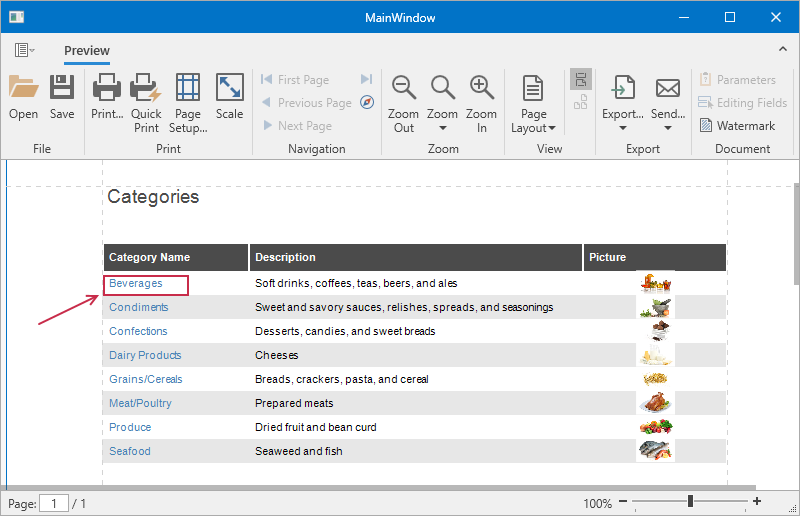
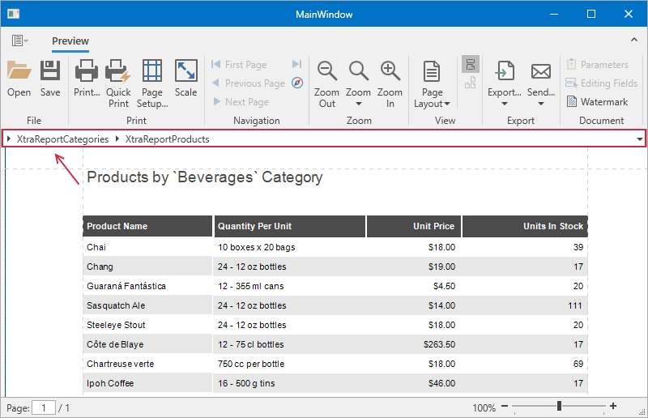

<!-- default badges list -->

<!-- default badges end -->
# Reporting for WPF - Create a Drill-through Report

This example shows a **drill-through report** in a WPF application. This report type keeps the original report compact while still allowing access to more detailed information.

The drill-trough report type requires **a parameter binding** to display connected data. You also need to set **a filter string** in the detail report to display product records for the selected category. See the guide for more detailed steps: [Create Drill-Through Reports](https://docs.devexpress.com/XtraReports/4789).

In the app, you can click a _Category_ entry to invoke a detail report with products:

Use breadcrumbs to navigate back to the original report. The breadcrumb control automatically appear below the Document Viewer toolbar:

## Files to Review

* [MainWindow.xaml.cs](./CS/MainWindow.xaml.cs) 
* [MainWindow.xaml](./CS/MainWindow.xaml)

## Documentation

- [Create Drill-Through Reports](https://docs.devexpress.com/XtraReports/4789/detailed-guide-to-devexpress-reporting/provide-interactivity/create-drill-through-reports)

## More Examples

- [Reporting for WPF - Create a Drill-through Report in Code](https://github.com/DevExpress-Examples/Reporting_documentpreviewcontrol-how-to-create-a-drill-down-report-runtime-sample-t337482)
- [Reporting for WinForms - Create a Drill-through Report](https://github.com/DevExpress-Examples/reporting-winforms-drill-through)
<!-- feedback -->
## Does this example address your development requirements/objectives?

 

(you will be redirected to DevExpress.com to submit your response)
<!-- feedback end -->
