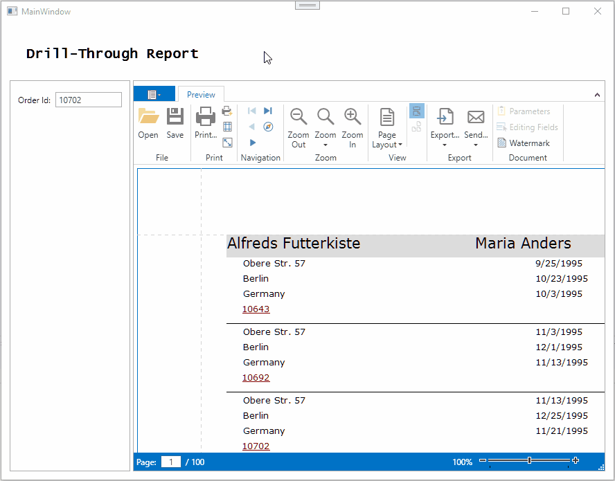

<!-- default badges list -->

<!-- default badges end -->
# Reporting for WPF - Create a Drill-through Report

This example shows how you can create a drill-through report. A drill-through report displays a separate report with detailed data after the user clicks an item in the main report.

## Files to Review

* [MainViewModel.cs](./CS/Viewer/MainViewModel.cs) 
* [MainWindow.xaml](./CS/Viewer/MainWindow.xaml)

## Documentation

- [Create Drill-Through Reports](https://docs.devexpress.com/XtraReports/4789/detailed-guide-to-devexpress-reporting/provide-interactivity/create-drill-through-reports)

## More Examples

- [Reporting for WPF - Create a Drill-through Report in Code](https://github.com/DevExpress-Examples/Reporting_documentpreviewcontrol-how-to-create-a-drill-down-report-runtime-sample-t337482)
- [Reporting for WinForms - Create a Drill-through Report](https://github.com/DevExpress-Examples/reporting-winforms-drill-through)
<!-- feedback -->
## Does this example address your development requirements/objectives?

 

(you will be redirected to DevExpress.com to submit your response)
<!-- feedback end -->
